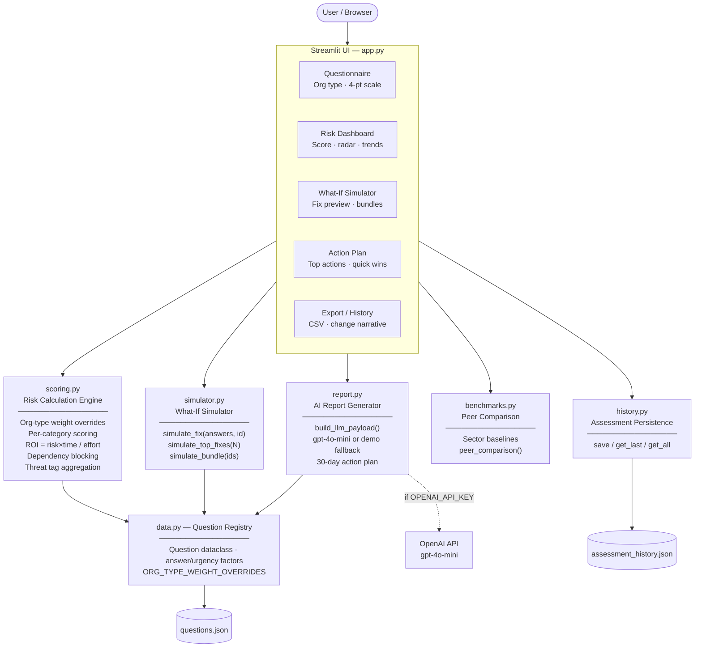

# RiskLens AI

Cyber risk assessment assistant for small organizations — built for HackMISSO 2026.

## Architecture




## What it does

- Runs a structured cybersecurity questionnaire tailored to your sector (clinic, school, nonprofit, startup, small business)
- Calculates a 0–100 risk score and per-category scores using sector-aware weighting
- Ranks every unmet control by ROI (risk impact ÷ effort × time-to-value)
- Simulates "what if we fix this?" — shows projected score gain and risk-level change before committing resources
- Compares your scores against sector peer baselines in a category-by-category table (baselines are expert-heuristic estimates, not external survey data)
- Generates a plain-language report with a 30-day action plan — LLM-powered if an OpenAI key is present, deterministic demo output otherwise
- Tracks assessment history and surfaces what changed between runs
- Exports the full assessment to CSV

## Stack

- Streamlit
- Pure Python scoring and simulation engine (no ML, fully deterministic)
- OpenAI API (optional) — gpt-4o-mini for report generation; falls back to a built-in demo report without a key
- python-dotenv

## Run locally

```bash
python -m venv .venv
source .venv/bin/activate
pip install -r requirements.txt
streamlit run app.py
```

## Environment variables

Optional. Required only for LLM-powered reports.

```bash
export OPENAI_API_KEY=your_key_here
```

Or add to a `.env` file in the project root — loaded automatically via python-dotenv.

Without a key the app is fully functional; the AI report section renders a deterministic demo report instead.

## Design decisions

- **Deterministic scoring** — every score is reproducible from the same answers; no randomness or ML inference in the core engine
- **ROI-first prioritization** — controls are ranked by `(risk_score × time_to_value_factor) / effort_factor`, not just severity
- **Sector weighting** — question weights are adjusted per org type so a clinic's HIPAA-adjacent controls carry more weight than a startup's
- **Heuristic baselines** — peer comparison figures are derived from assessment design assumptions, not collected survey data; they are directionally useful but not statistically validated

## Demo flow

1. Set org type in the sidebar
2. Answer the questionnaire (unanswered questions default to "Don't Know")
3. Click **Run Assessment**
4. Review the risk dashboard and biggest exposure
5. Check the peer comparison table
6. Use the What If Simulator to project the impact of specific fixes
7. Read the action plan

## Files

- `app.py` — Streamlit UI and orchestration
- `scoring.py` — weighted scoring engine and ROI prioritization
- `simulator.py` — fix simulation and score-delta calculations
- `benchmarks.py` — sector peer baselines and comparison logic
- `history.py` — assessment history persistence
- `report.py` — report generation (LLM payload builder + OpenAI call + demo fallback)
- `data.py` — question dataclass, category definitions, org-type weight overrides
- `questions.json` — question bank
- `requirements.txt` — dependencies
