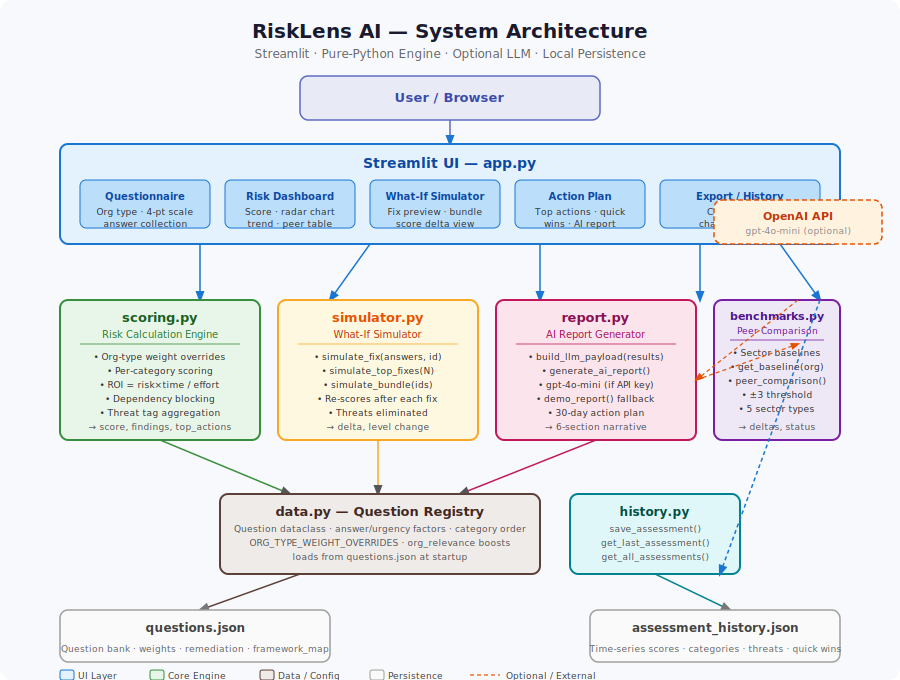

# RiskLens AI

Cyber risk assessment tool for small organizations — HackMISSO 2026 submission.

RiskLens asks a structured questionnaire, scores every unmet security control by ROI, simulates the impact of fixing specific gaps before you commit any resources, and produces a calibrated action plan — either AI-generated via GPT-4o-mini or as a deterministic fallback when no API key is present.

---

## Architecture




---

## Features

**Sector-aware questionnaire**
Covers six control categories across ~25 questions. Answer weights are adjusted per org type (clinic, school, nonprofit, startup, small business) so sector-relevant controls carry appropriate weight.

**Deterministic risk scoring**
Every score is reproducible from the same inputs — no ML inference in the core engine. The formula is:

```
contribution  = effective_weight × answer_factor
overall_score = 100 × (1 − Σcontribution / Σmax_weight)
roi_score     = (risk_score × time_to_value_factor) / effort_factor
```

Risk bands: **Critical** < 40 · **High** 40–59 · **Moderate** 60–79 · **Low** ≥ 80

**ROI-first prioritization**
Unmet controls are ranked by `roi_score` (risk impact × time-to-value / effort), not raw severity. Controls whose prerequisites are unresolved are surfaced last so the sequencing is always actionable.

**What-If Simulator**
Fixes any control in isolation or as a bundle and shows the projected score gain, risk-level change, and threats eliminated — before you spend any time or money.

**Peer benchmarking**
Category-level scores are compared against expert-heuristic baselines for each sector. Status flags (above / on-par / below) use a ±3-point threshold.

**AI recommendation agent**
- With `OPENAI_API_KEY`: calls GPT-4o-mini with a structured, org-size-calibrated prompt that enforces prioritization ordering, specificity depth, and section length scaled to org size (a 5-person org gets a 2-item 30-day plan; a 200-person clinic gets 5 items with governance framing).
- Without a key: falls back to a deterministic template that produces the same six sections.

Output sections: Biggest Risk Right Now · Best Quick Win · Best 30-Day Plan · Highest-Impact Fix · Why These Actions Matter · Confidence / Unknowns

**Assessment history and trend tracking**
Each run is saved locally. The dashboard surfaces score trends over time and a plain-language "what changed" summary between the current and previous assessment.

**CSV export**
Full assessment — scores, findings, ROI rankings, remediation steps — exported as a single CSV.

---

## Stack

| Layer | Technology |
|---|---|
| UI | Streamlit |
| Scoring / simulation | Pure Python — fully deterministic, no ML |
| Charts | Plotly |
| Data handling | Pandas |
| Report generation | OpenAI API (`gpt-4o-mini`) — optional |
| Config | python-dotenv |

---

## Quick start

```bash
git clone <repo>
cd risklens_ai

python -m venv .venv
source .venv/bin/activate       # Windows: .venv\Scripts\activate

pip install -r requirements.txt
streamlit run app.py
```

---

## Environment variables

Only required for AI-powered reports. The app is fully functional without a key.

```bash
# Option 1 — shell export
export OPENAI_API_KEY=sk-...

# Option 2 — .env file in project root (auto-loaded)
OPENAI_API_KEY=sk-...
```

Without a key the AI report section renders a deterministic demo report with identical structure.

---

## Demo flow

1. Set **org name**, **org type**, and **org size** in the sidebar.
2. Work through the questionnaire — unanswered questions default to *Don't Know* (worst-case).
3. Click **Run Assessment**.
4. Review the score, per-category radar, and peer comparison table.
5. Expand **Top 3 Priority Actions** to see the ROI-ranked controls.
6. Open the **What-If Simulator** — select individual fixes or bundle the top controls to preview the combined impact.
7. Read the **AI Recommendation Agent** output for a sequenced 30-day action plan.
8. Download the **CSV export** or re-run the assessment later to track trend movement.

---

## Project structure

```
risklens_ai/
├── app.py                    # Streamlit UI and orchestration
├── scoring.py                # Weighted scoring engine and ROI prioritization
├── simulator.py              # Fix simulation and score-delta calculations
├── report.py                 # LLM payload builder, OpenAI call, demo fallback
├── benchmarks.py             # Sector peer baselines and comparison logic
├── history.py                # Assessment history persistence
├── data.py                   # Question dataclass, category order, org-type overrides
├── questions.json            # Question bank (~25 questions, full metadata)
├── requirements.txt          # Python dependencies
├── architecture.svg          # System architecture diagram
└── assessment_history.json   # Local assessment history (auto-created on first run)
```

---

## Design decisions

**Deterministic scoring over ML**
Every score is reproducible and auditable from the same answer set. This matters for small-org advisors who need to explain a score to a non-technical owner, not just show a number.

**ROI ranking over severity ranking**
Sorting by raw severity pushes high-effort, high-impact controls to the top regardless of feasibility. ROI ranking surfaces controls that are both impactful and achievable given the org's capacity.

**Dependency-aware sequencing**
Controls that depend on unresolved prerequisites are moved to the bottom of every ranked list and flagged explicitly. The 30-day plan is always executable in order without hidden assumptions.

**Org-size-calibrated AI prompt**
The LLM prompt scales output depth to org size: section sentence limits, number of 30-day plan items, tool specificity requirements, and governance framing are all derived from the `org_size` field before the prompt is assembled. A 5-person org and a 200-person clinic receive structurally different reports.

**Heuristic peer baselines**
Sector comparison figures are derived from assessment design assumptions, not collected survey data. They are directionally useful for motivating action but are not statistically validated — this is noted in the UI.

**Graceful LLM fallback**
The demo report uses the same six-section structure as the AI report and is generated deterministically from the same payload. The app is fully usable in environments without an API key.
